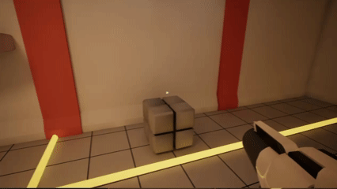
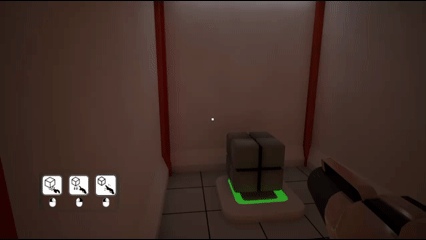
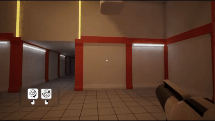

# \#Ability Demo

Ability demo is a first-person prototype developed in Unreal Engine 5, using \*\*C++\*\* with \*\*Blueprint integration\*\*.

This short demo introduces the player to 4 different rooms, each focused on a unique ability.

\##Room:

* \*\*Room 1\*\*: Grab
* \*\*Room 2\*\*: Recall
* \*\*Room 3\*\*: Freeze
* \*\*Room 4\*\*: All abilities combined in on final challenge

\##Overview of the Mechanics:

\*\*Grab\*\*

\*\*Recall\*\*

\*\*Freeze\*\*

---

\##Link

Play the Demo: https://egril011.itch.io/ability-demo

--

\##Note

This project was created as a personal portfolio demo to showcase my programming skill.

&nbsp;

All the assets were from \*\*sketchfab.com\*\*, and all the images were generated using \*\*AI tools\*\*.  

